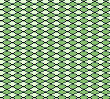
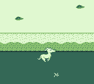
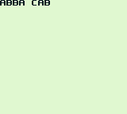
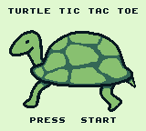

# GB
This is just some collection of random GameBoy programs I've programmed. Nothing too amazing really.

## Requirements
To compile the roms, you will need a few things:
* WLA-GB assembler

## Pre-compiled ROMs
I will include the latest compiled *.gb file but no guarantees that it will be the most recent version. I do this for those who can't bother to compile the programs or don't know how.

## Screenshots

###Bg
Scrolling background demo.

###Run
Whippet runs along a beach!

###Sprite
Simple sprite on screen and D-pad moves it around.

###Text
Simple text demo.

###xo
Turtle Tic Tac Toe

