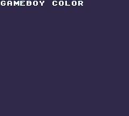
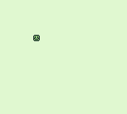

# GB
This is just some collection of random GameBoy programs I've programmed. Nothing too amazing really.

## Requirements
To compile the roms, you will need a few things:
* WLA-GB assembler

## Pre-compiled ROMs
I will include the latest compiled *.gb file but no guarantees that it will be the most recent version. I do this for those who can't bother to compile the programs or don't know how.

## Screenshots

### Bg
Scrolling background demo.

### Detect
Detects the system that the rom is connected to.

### Run
Whippet runs along a beach!

### Scroll
Scrolls vertically for a 256 tile high map. Actual tilemap is not that large so there is a lot of whitespace in there.

### Sprite
Simple sprite on screen and D-pad moves it around.

### Text
Simple text demo.

### XO
Turtle Tic Tac Toe

